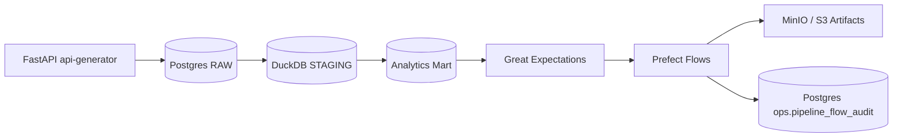

# Data Reliability Platform

End-to-end data reliability and orchestration platform built with **Prefect**, **PostgreSQL**, **DuckDB**, **MinIO**, and **Great Expectations**.  
The repository demonstrates a working layered pipeline (`RAW -> STAGING -> ANALYTICS`) with quality gates, object-store archival, and flow-level observability.

[](https://www.python.org/)
[](https://www.docker.com/)
[](https://www.prefect.io/)
[](https://greatexpectations.io/)

## Architecture Overview

Pipeline layers implemented in this project:

- **Data Generator / API**: FastAPI service emits synthetic orders.
- **RAW layer**: PostgreSQL table `raw.orders_raw` stores source-faithful ingestion records.
- **STAGING layer**: DuckDB table `staging.orders` standardizes and deduplicates data.
- **ANALYTICS layer**: DuckDB mart `analytics.daily_order_metrics` provides aggregated metrics.
- **Quality validation**: Great Expectations checks run during stage/validate flow.
- **Orchestration**: Prefect executes ingestion and stage/validate flows.
- **Object Storage**: MinIO (S3-compatible) stores raw batch and analytics snapshot artifacts.



## Project Intent

This project was built as a production-inspired data platform exercise developed iteratively over approximately 4 months (part-time development).

The primary goal was not to create a tutorial-style pipeline, but to simulate how a real data platform evolves through incremental engineering decisions, refactoring cycles, and reliability improvements.

Coming from a QA automation and data-focused background, I intentionally approached the platform from a reliability-first perspective:
- treating data pipelines as systems that must be testable and observable
- applying QA principles to data quality and orchestration
- designing validation as a first-class concern rather than an afterthought
- focusing on reproducibility and operational visibility

The project reflects my transition from QA engineering toward Data Platform / Data Engineering roles, combining:
- automation mindset from QA engineering
- data validation and quality guarantees
- orchestration and pipeline lifecycle management
- platform-oriented architectural thinking

Instead of optimizing for complexity or scale, the design prioritizes clarity of engineering decisions and real-world platform patterns, including:
- layered data modeling (RAW → STAGING → ANALYTICS)
- orchestration-driven workflows
- expectation-based quality gates
- observability and audit logging
- storage abstraction aligned with cloud migration paths

Development was intentionally iterative:
- ingestion prototype and local platform bootstrap
- layered storage separation
- orchestration integration with Prefect
- data quality enforcement using Great Expectations
- observability and flow audit tracking
- artifact archival and S3-compatible storage design

This mirrors how data platforms are typically developed in production environments — evolving through validation, debugging, and architectural refinement rather than being built in a single iteration.

The repository therefore serves both as a technical portfolio project, and a personal engineering transition project demonstrating applied data platform concepts beyond QA automation.

## Tech Stack

| Layer | Technology | Purpose |
|---|---|---|
| Runtime | Python 3.12 | Pipeline code, orchestration tasks, quality logic |
| Orchestration | Prefect | Flow/task execution, retries, run state tracking |
| RAW Storage | PostgreSQL | Source-faithful ingestion layer + ops audit table |
| STAGING / ANALYTICS | DuckDB | Transformations and analytics mart materialization |
| Data Quality | Great Expectations | Expectation-based validation gates |
| Object Storage | MinIO (S3-compatible) | Artifact archival for raw/analytics snapshots |
| Platform Runtime | Docker Compose | Local multi-service platform environment |

## Running the Platform (Quick Start)

```bash
docker compose up -d
docker compose ps
```

Expected running services:

- `postgres`
- `prefect`
- `minio`
- `pipeline`
- `api-generator`

Run pipeline flows:

```bash
docker compose exec pipeline bash /app/scripts/run-ingest-flow.sh
docker compose exec pipeline bash /app/scripts/run-stage-validate-flow.sh
```

Or full sequence:

```bash
docker compose exec pipeline bash /app/scripts/run-full-pipeline.sh
```

## Pipeline Execution Evidence

All commands below map to implemented code paths and verified local runs.

### RAW ingestion proof

```bash
docker compose exec -T postgres psql -U drp_user -d drp_platform -c "SELECT COUNT(*) FROM raw.orders_raw;"
```

Expected result (after one ingestion run):

```text
 count
-------
   100
```

What this proves: source events were extracted and persisted into the RAW layer.

### Staging layer proof (DuckDB)

```bash
docker compose exec -T pipeline python -c "import duckdb; c=duckdb.connect('/app/data/analytics/warehouse.duckdb'); print(c.execute('SELECT COUNT(*) FROM staging.orders').fetchall())"
```

What this proves: transformation step materialized records into the STAGING table.

### Analytics mart proof

```bash
docker compose exec -T pipeline python -c "import duckdb; c=duckdb.connect('/app/data/analytics/warehouse.duckdb'); print(c.execute('SELECT * FROM analytics.daily_order_metrics ORDER BY order_date').fetchall())"
```

What this proves: analytics aggregation was built successfully from staged data.

### Data Quality Validation

Great Expectations executes inside `stage-and-validate-orders` and validates staged records.

Observed success log evidence:

```text
6 expectation(s) included in expectation_suite.
Finished in state Completed()
```

What this proves: expectation checks ran and returned a passing state for the run.

### Prefect Orchestration Evidence

Prefect orchestrates task execution and state transitions for both flows.

Observed success log evidence:

```text
Finished stage/validate flow staged_rows=100 analytics_rows=1 quality_success=True
```

UI reference:

- `http://localhost:4200`

What you see in UI: flow run history, task-level states, timestamps, and run outcomes.

### Object Storage Evidence (MinIO)

Artifacts are archived by flow tasks:

- raw ingestion batch JSON
- analytics parquet snapshot

Command:

```bash
bash scripts/object-store/list-artifacts.sh
```

Expected output structure:

```text
<timestamp>  <size>  raw/orders/ingest_date=YYYY-MM-DD/batch_id=<uuid>.json
<timestamp>  <size>  analytics/orders/snapshot_date=YYYY-MM-DD/daily_order_metrics.parquet
```

## Data Model

| Schema | Role | Example Tables |
|---|---|---|
| `raw` | Source-faithful ingestion storage | `orders_raw` |
| `staging` | Cleaned and standardized transform layer | `orders` |
| `analytics` | Aggregated business-facing outputs | `daily_order_metrics` |
| `ops` | Operational observability/audit data | `pipeline_flow_audit` |

## Observability

Flow telemetry is written to PostgreSQL audit table `ops.pipeline_flow_audit` by the flow monitor layer.

Example query:

```bash
docker compose exec -T postgres psql -U drp_user -d drp_platform -c "SELECT flow_name, status, started_at, duration_seconds FROM ops.pipeline_flow_audit ORDER BY started_at DESC LIMIT 10;"
```

What this enables: run-level monitoring, incident triage, and reliability trend analysis.

## Data Quality Strategy

Implemented quality checks include:

- schema-oriented checks through expected columns used in validation
- null checks (`source_order_id`, `customer_id`, `order_created_at`)
- business rule check (`amount >= 0`)
- uniqueness check (`source_order_id`)
- fail-fast flow behavior when expectations fail (`run-quality-checks` raises)

## Design Decisions

- **DuckDB for analytics**: lightweight analytical engine with fast local execution and simple artifact export.
- **PostgreSQL for RAW**: durable transactional store for source-faithful ingestion and replayability.
- **Prefect vs Airflow**: simpler local-first setup with clear Python-native flow/task semantics for this platform scope.
- **MinIO vs S3**: local S3-compatible runtime now, same integration pattern for cloud migration later.
- **Great Expectations**: explicit, test-like quality contracts embedded into orchestration flow.

## Repository Structure

```text
data-reliability-platform/
├── src/drp/
│   ├── config/                  # typed settings and env mapping
│   ├── ingestion/               # API connector + ingestion service
│   ├── storage/
│   │   ├── postgres/            # RAW repository + ops audit writes
│   │   ├── duckdb/              # STAGING / ANALYTICS repository
│   │   └── object_store/        # S3-compatible archival adapters
│   ├── transform/               # staging + analytics services
│   ├── quality/                 # Great Expectations validator
│   ├── orchestration/prefect/   # flow definitions
│   └── observability/           # flow audit + alerting
├── scripts/                     # run, monitoring, CI, and demo scripts
├── ops/monitoring/              # runbook + SQL health queries
├── infra/docker/                # service Dockerfiles
├── tests/                       # unit + integration tests
└── docker-compose.yml           # local platform topology
```

## Example Successful Run (End-to-End)

Observed successful `stage-and-validate-orders` run values:

- `staged_rows = 100`
- `analytics_rows = 1`
- `quality_success = True`

Lifecycle completed:

1. RAW records extracted from PostgreSQL
2. STAGING table rebuilt in DuckDB
3. ANALYTICS mart refreshed
4. Great Expectations checks passed
5. analytics snapshot archived to object storage
6. run metadata stored in `ops.pipeline_flow_audit`


## Portfolio Context

This repository demonstrates practical engineering skills in orchestration, layered data modeling, reliability engineering, observability, and data quality enforcement.  
It is designed as a production-inspired local platform for architectural experimentation and portfolio demonstration.  
The implementation focuses on reproducibility and operational clarity, without claiming production deployment.

## Author

Jakub Zając — Data Engineer / QA Automation / AWS Data Platforms

GitHub: https://github.com/limitl3ss01  
LinkedIn: https://www.linkedin.com/in/zajac-jakub-qa/
